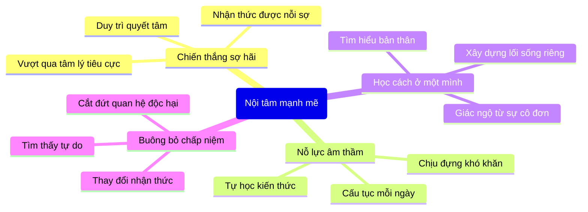

> [!summary]- Mô tả
> Video hôm nay mình sẽ nói về một cuốn sách trong Tủ sách Tự truyện, sách những người nổi tiếng của Better Version, đây là một chia sẻ mang tên "Một nội tâm mạnh mẽ là liều thuốc cho tất cả" qua cuốn tự truyện Educated - Được học của tác giả, nhà lịch sử học Tara Westover.

## Tóm tắt nội dung

Cuốn sách **Educated** kể câu chuyện thực của Tara Westover - một cô gái lớn lên ở vùng núi Idaho trong một gia đình theo đạo M bảo thủ, không tin vào khoa học hay giáo dục chính quy. Mặc dù phải chịu đựng hoàn cảnh cơ cực, bạo lực gia đình, và sự cô lập tâm lý, Tara đã sử dụng nội tâm mạnh mẽ để thoát khỏi gông cùm. Cô kiên trì tự học, vượt qua những nỗi sợ hãi sâu thẳm, và cuối cùng được nhận vào Đại học Cambridge để học thạc sĩ.

Câu chuyện của Tara chứng minh rằng thành công không phụ thuộc vào xuất thân hay điều kiện gia đình, mà phụ thuộc vào bốn năng lực cốt lõi của nội tâm: chiến thắng nỗi sợ hãi, nỗ lực trong âm thầm, học cách ở một mình, và buông bỏ chấp niệm. Dù cuối cùng phải cắt đứt mối quan hệ với gia đình, Tara đã tìm thấy tự do, hạnh phúc và bản sắc thực của chính mình thông qua giáo dục và tự khám phá.

## Điểm chính

- Chiến thắng nỗi sợ hãi bên trong là bước đầu tiên để vượt qua nghịch cảnh
- Nỗ lực âm thầm - tích lũy kiến thức từng chút một dẫn đến thành công
- Sự cô đơn không phải yếu đếu mà là sức mạnh để tái tạo bản thân
- Giáo dục là chìa khóa mở cửa đến thế giới mới và độc lập
- Buông bỏ chấp niệm cũ là cần thiết để tiến bộ và sống tự do
- Tình yêu gia đình có thể tồn tại từ một khoảng cách xa xôi
- Người ta có thể yêu ai đó nhưng vẫn chọn rời xa để bảo vệ bản thân

## Sơ đồ tư duy

