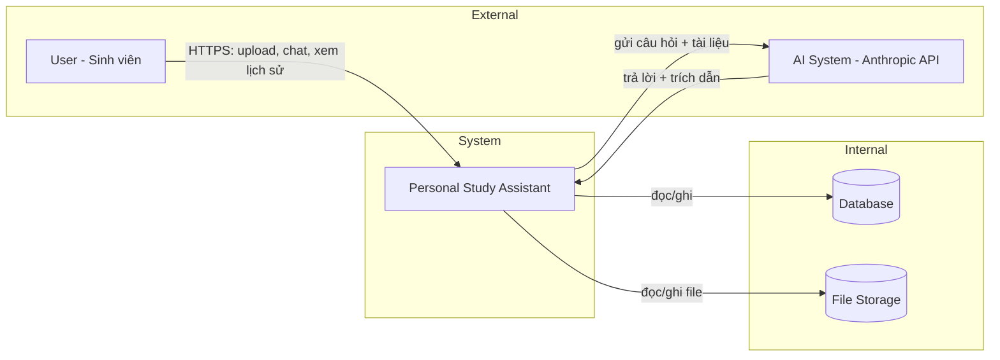
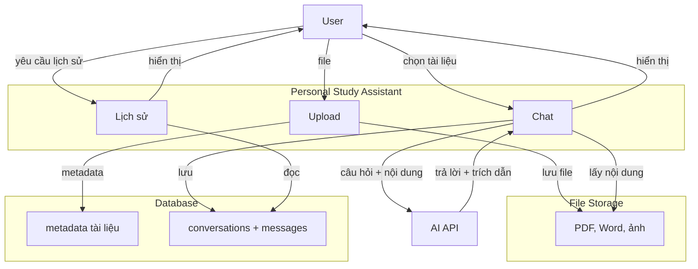

## 1. System Context Diagram
### Actor / External System

| Tên                           | Loại               | Tương tác                                          |
| ----------------------------- | ------------------ | -------------------------------------------------- |
| **User** (sinh viên)          | Người dùng         | Đăng ký, đăng nhập, upload file, chat, xem lịch sử |
| **AI System** (Anthropic API) | Hệ thống bên ngoài | Xử lý câu hỏi, trả lời có trích dẫn                |
| **Browser** (trình duyệt)     | Môi trường         | Gửi request, nhận response                         |
### Sơ đồ Context
```
┌─────────────────────────────────────────────────────────────────┐
│                         EXTERNAL WORLD                          │
├─────────────────────────────────────────────────────────────────┤
│                                                                 │
│  ┌──────────┐                      ┌──────────────────────┐    │
│  │          │                      │   AI System          │    │
│  │   User   │                      │   (Anthropic API)    │    │
│  │ (sinh viên)│                     │                      │    │
│  └────┬─────┘                      └──────────┬───────────┘    │
│       │                                       │                │
│       │ HTTPS / REST                          │ HTTPS / REST   │
│       │ (upload, chat,                        │ (gửi câu hỏi,  │
│       │  lịch sử...)                          │  nhận trả lời) │
│       ▼                                       ▲                │
│  ┌─────────────────────────────────────────────────────┐      │
│  │                                                     │      │
│  │     PERSONAL STUDY ASSISTANT (Web App)              │      │
│  │                                                     │      │
│  │  - Xác thực người dùng                              │      │
│  │  - Lưu tài liệu (PDF, Word, ảnh)                    │      │
│  │  - Quản lý ngữ cảnh chat                            │      │
│  │  - Lưu lịch sử chat                                 │      │
│  │  - Gọi AI API                                       │      │
│  │                                                     │      │
│  └─────────────────────────────────────────────────────┘      │
│         │                              │                       │
│         │                              │                       │
│         ▼                              ▼                       │
│  ┌──────────────┐              ┌──────────────┐               │
│  │   Database   │              │   Storage    │               │
│  │  (PostgreSQL/│              │   (S3/local) │               │
│  │   SQLite)    │              │              │               │
│  └──────────────┘              └──────────────┘               │
│                                                                 │
└─────────────────────────────────────────────────────────────────┘
```
### Sơ đồ Context (dạng Mermaid)


## Data Flow Diagram (Luồng dữ liệu)

**Mục đích:** Mô tả **dữ liệu di chuyển thế nào** giữa các thành phần.

### DFD mức 0 (tổng thể)

Chỉ có 1 tiến trình chính: **Personal Study Assistant**

```
┌─────────┐     credentials, file    ┌─────────────────────┐
│  User   │ ───────────────────────→ │                     │
│         │ ←─── auth token, list ─── │  Personal Study     │
└─────────┘      document, answer     │  Assistant          │
                                      │                     │
                                      │   (toàn bộ logic)   │
                                      └──────────┬──────────┘
                                                 │
                         câu hỏi + nội dung      │
                         ───────────────────────→
                                                 │
                                      ┌──────────┴──────────┐
                                      │   AI System (API)   │
                                      │ ←─── answer + cites ─│
                                      └─────────────────────┘
```

### DFD mức 1 (chi tiết các luồng chính)

Tôi sẽ mô tả **4 luồng dữ liệu cốt lõi**:

#### 1. Upload file

```
User ──file (PDF/Word/ảnh)──→ App ──lưu file──→ Storage
                           └── metadata (user_id, filename, ngày) ──→ Database
```

#### 2. Chọn tài liệu để chat

```
User ──selected_doc_ids──→ App ──lấy nội dung từ storage──→ Storage
                         └── gửi context (doc_ids) vào session (lưu trong DB)
```

#### 3. Chat với AI

```
User ──câu hỏi──→ App ──lấy nội dung tài liệu đã chọn từ Storage
                └── (câu hỏi + nội dung) ──→ AI API
                ←── (câu trả lời + citations) ── AI API
                └── lưu {câu hỏi, trả lời, citations, timestamp} vào Database
                └── hiển thị câu trả lời ──→ User
```

#### 4. Xem lịch sử chat

```
User ──yêu cầu lịch sử──→ App ──get history──→ Database
                         ←── list conversations ──
                         └── hiển thị cho User
```

---

### DFD Mermaid (dạng đơn giản)


Dưới đây là **định nghĩa entity chính** cho Personal Study Assistant, ở mức BA (không đi sâu vào chi tiết database kỹ thuật, chỉ nêu thuộc tính cần thiết và mối quan hệ).

---

## Entity: User

| Thuộc tính | Kiểu | Mô tả |
|------------|------|-------|
| UserID | ID (duy nhất) | Định danh người dùng (UUID hoặc số tự tăng) |
| Email | String | Dùng để đăng nhập, phải là duy nhất |
| PasswordHash | String | Mật khẩu đã được mã hóa (hash) |
| FullName | String (optional) | Họ tên (có thể để trống) |
| CreatedAt | Timestamp | Thời điểm tạo tài khoản |
| LastLoginAt | Timestamp | Lần đăng nhập cuối cùng |

**Quan hệ:**
- Một User có nhiều Document (1:N)
- Một User có nhiều Conversation (1:N)

---

## Entity: Document

| Thuộc tính | Kiểu | Mô tả |
|------------|------|-------|
| DocumentID | ID (duy nhất) | Định danh tài liệu |
| UserID | Foreign Key | Liên kết với User sở hữu tài liệu |
| FileName | String | Tên file gốc khi upload |
| FileType | Enum | `PDF`, `DOCX`, `IMAGE` |
| FileSize | Integer (bytes) | Dung lượng file (≤10MB) |
| StoragePath | String | Đường dẫn lưu file (local hoặc cloud) |
| ExtractedText | Text (optional) | Nội dung đã được trích xuất (text thuần, OCR nếu ảnh) |
| UploadedAt | Timestamp | Thời điểm upload |
| Status | Enum | `processing`, `ready`, `failed` |

**Quan hệ:**
- Document thuộc về một User (N:1)
- Một Document có thể tham gia nhiều Conversation (qua bảng liên kết, nhưng trong logic chat, ngữ cảnh là tập hợp các Document, không phải quan hệ trực tiếp giữa Document và Conversation). Tạm thời không cần bảng trung gian nếu dùng “selected documents” lưu trong session hoặc trong Message context.

---

## Entity: Conversation

| Thuộc tính | Kiểu | Mô tả |
|------------|------|-------|
| ConversationID | ID (duy nhất) | Định danh phiên chat |
| UserID | Foreign Key | Liên kết với User |
| Title | String | Tiêu đề tự sinh (ví dụ: "Chat về chương 3 - 15/01") |
| CreatedAt | Timestamp | Thời gian bắt đầu phiên |
| LastUpdatedAt | Timestamp | Lần cuối có tin nhắn mới |
| ContextDocuments | Array of DocumentID (optional) | Lưu lại danh sách tài liệu được chọn khi bắt đầu phiên (để hiển thị sau) |

**Quan hệ:**
- Một Conversation thuộc về một User (N:1)
- Một Conversation có nhiều Message (1:N)

---

## Entity: Message

| Thuộc tính | Kiểu | Mô tả |
|------------|------|-------|
| MessageID | ID (duy nhất) | Định danh tin nhắn |
| ConversationID | Foreign Key | Liên kết với phiên chat |
| Role | Enum | `user` hoặc `assistant` |
| Content | Text | Nội dung câu hỏi hoặc câu trả lời |
| Citations | JSON (hoặc Text) | Trích dẫn từ tài liệu: `[{"file":"a.pdf", "snippet":"..."}]` |
| CreatedAt | Timestamp | Thời điểm tin nhắn |

**Quan hệ:**
- Một Message thuộc về một Conversation (N:1)

---

## Mối quan hệ giữa các entity (sơ đồ ER)

```
erDiagram
    USER ||--o{ DOCUMENT : owns
    USER ||--o{ CONVERSATION : has
    CONVERSATION ||--o{ MESSAGE : contains
    DOCUMENT }o--o{ CONVERSATION : "can be selected in" (optional)
```


