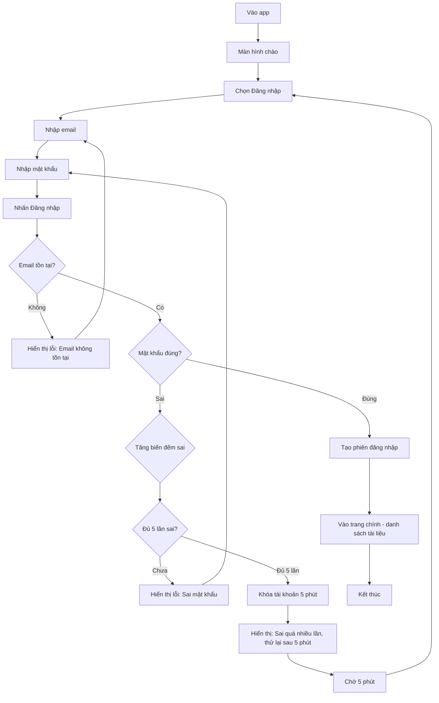
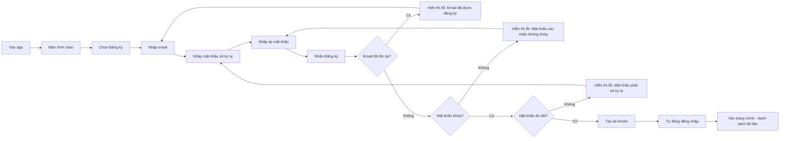
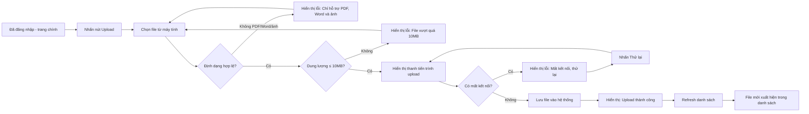
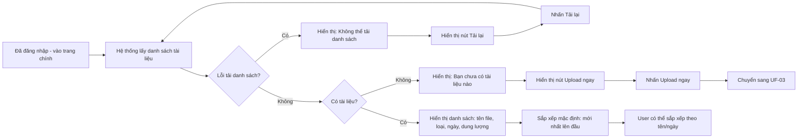
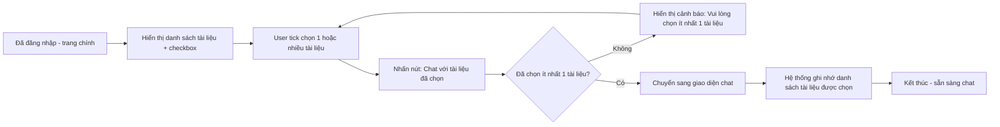
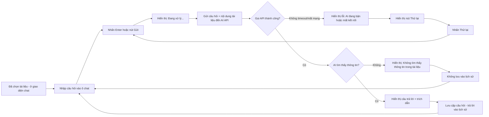
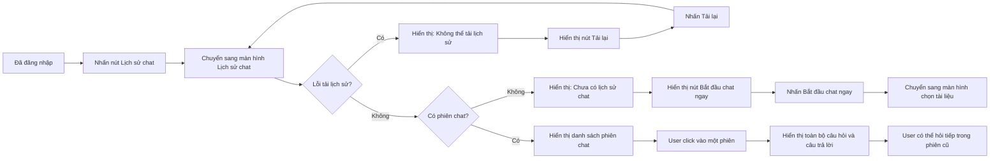
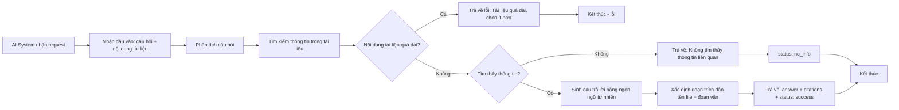

### UC02-đăng nhập

### UC01: Đăng ký

## UF-03: Upload file (UC03)

## UF-04: Xem danh sách tài liệu (UC04)

## UF-05: Chọn tài liệu làm ngữ cảnh (UC05)

## UF-06: Chat với AI (UC06)

## UF-07: Xem lịch sử chat (UC07)

## UF-08: Xử lý câu hỏi và trả lời (UC08 - AI System)

